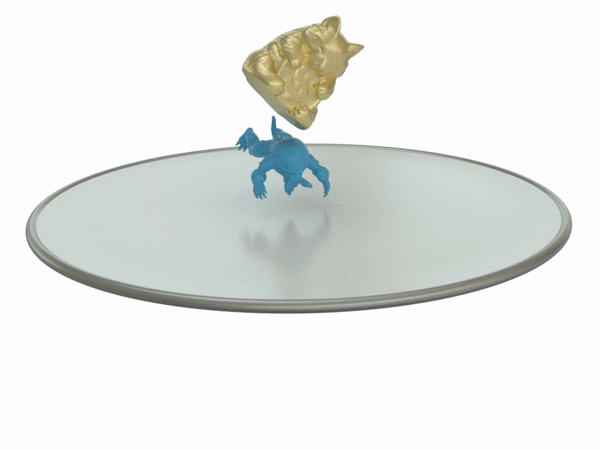
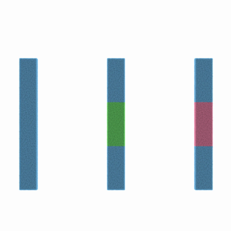
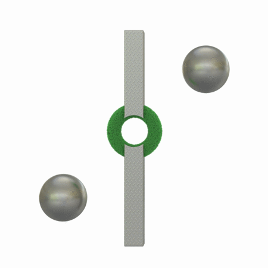
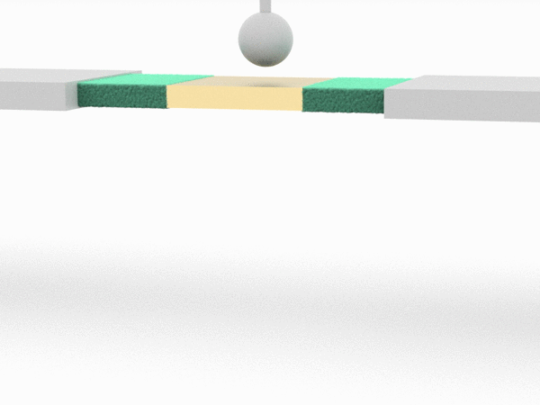

# Hierarchical Optimization Time Integration (HOT)

## Description

This is the opensource code for the paper:

**Hierarchical Optimization Time Integration for CFL-Rate MPM Stepping** (https://dl.acm.org/doi/10.1145/3386760)

[Xinlei Wang](https://github.com/littlemine)\*, 
[Minchen Li](https://www.seas.upenn.edu/~minchenl/)\*, 
[Yu Fang](http://squarefk.com/), 
[Xinxin Zhang](https://zhxx1987.github.io/), 
[Ming Gao](https://mingg13.github.io/), 
[Min Tang](https://min-tang.github.io/home/), 
[Danny M. Kaufman](http://dannykaufman.io/), 
[Chenfanfu Jiang](https://www.seas.upenn.edu/~cffjiang/)

<p float="left">




</p>

<p float="left">




</p>

## Compilation
The following instruction is tested on Ubuntu 18.04 LTS with g++7.4, on Ubuntu 19.10 with g++7.4, g++8.4, clang-9. 

### Dependencies

Run the command to install all dependencies:

```
sudo apt-get install make cmake g++ libeigen3-dev gfortran libmetis-dev 
sudo apt-get install libopenvdb-dev libboost-all-dev libilmbase-dev libopenexr-dev 
sudo apt-get install libtbb2 libtbb-dev libz-dev clang-format-6.0 clang-format libarpack2-dev
pip install --upgrade cmake
```

### Build
Run the following command in the root directory.

```
make Release
```

Or use the cmake toolchain.

```
mkdir build && cd build && cmake .. && make -j4
```

## Benchmarks

### Data

Extract all models at *Data/LevelSets* in place.

### Run Demos
Go to the project directory (*Projects/multigrid/*), check all default settings included in *Configurations.h* file.

To test different setups, run commands with specific options. For example:
```
./multigrid -test 777011 --3d --usecn -cneps 1e-7 -lsolver 3 -Ainv 1 --project --linesearch --bcproject -mg_level 3 -mg_times 1 -coarseSolver 2 -smoother 5 --l2norm -o faceless_lbfgs
```
Here are some of the command options:
- usecn: whether to use characteristic norm
- cneps: epsilon of characteristic norm
- lsolver: numerical method
- coarseSolver: top level solver in multigrid
- smoother: non-top level smoother in multigrid
- ...

Please see bash script *tog.sh* and *README* for more details.

## Bibtex

Please cite our paper if you use this code for your research: 
```
@article{10.1145/3386760,
author = {Wang, Xinlei and Li, Minchen and Fang, Yu and Zhang, Xinxin and Gao, Ming and Tang, Min and Kaufman, Danny M. and Jiang, Chenfanfu},
title = {Hierarchical Optimization Time Integration for CFL-Rate MPM Stepping},
year = {2020},
issue_date = {April 2020},
publisher = {Association for Computing Machinery},
address = {New York, NY, USA},
volume = {39},
number = {3},
issn = {0730-0301},
url = {https://doi.org/10.1145/3386760},
doi = {10.1145/3386760},
journal = {ACM Trans. Graph.},
month = apr,
articleno = {Article 21},
numpages = {16},
keywords = {multigrid, optimization integrator, quasi-Newton, Material point method (MPM)}
}
```